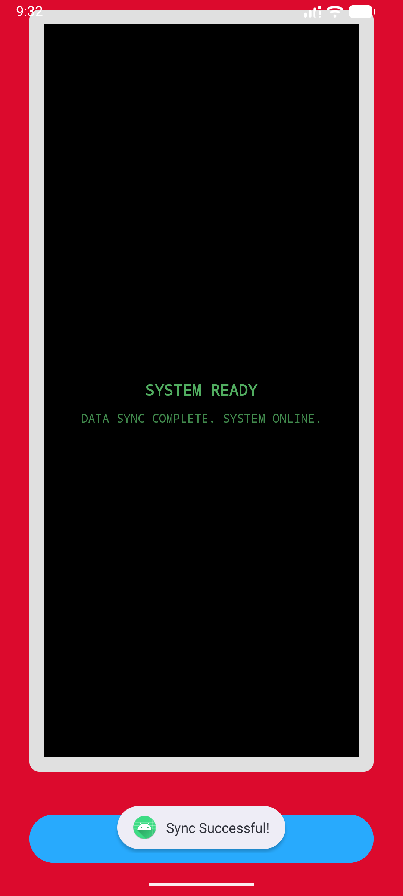
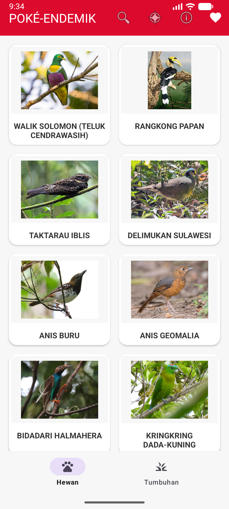
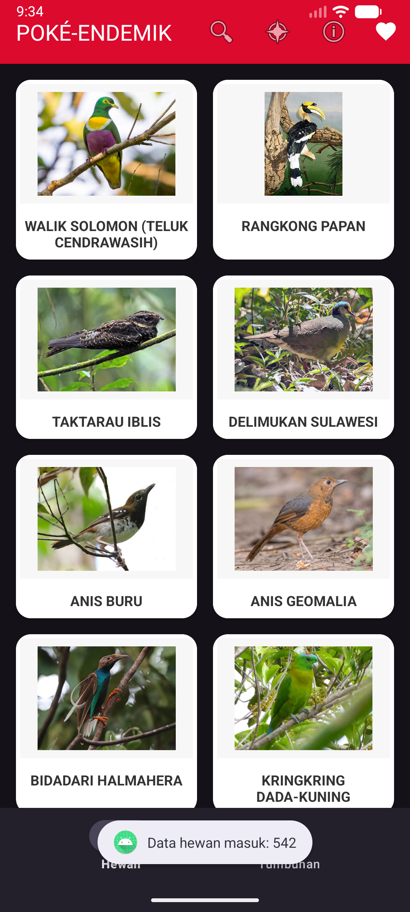
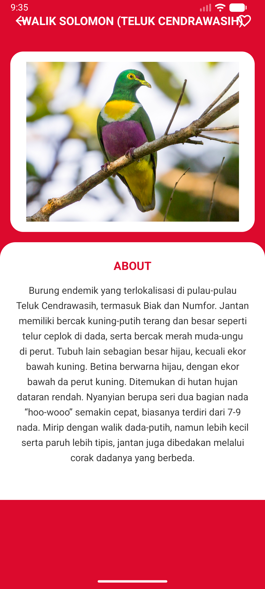
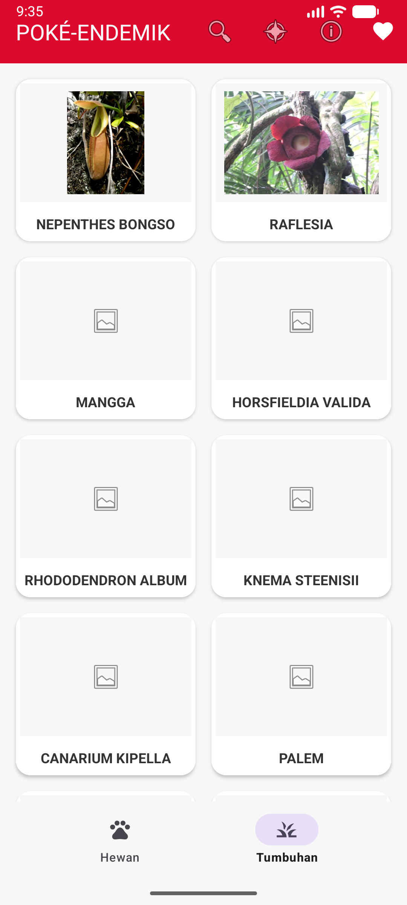
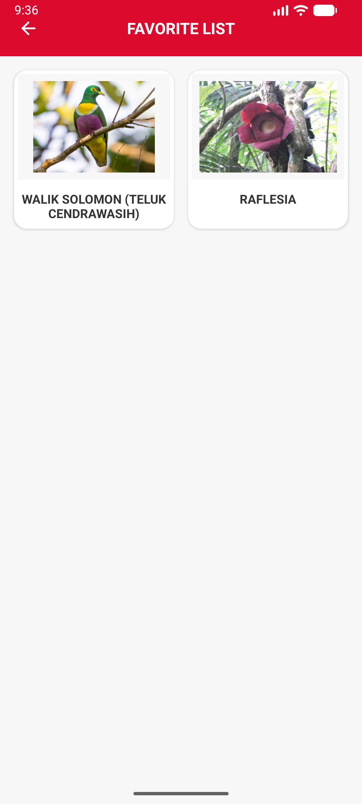
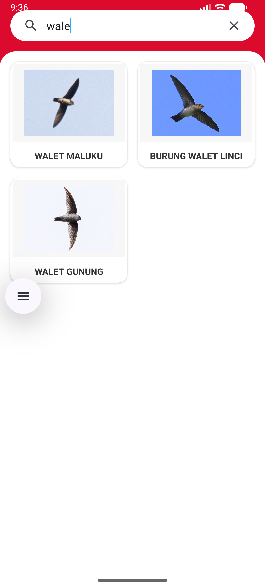
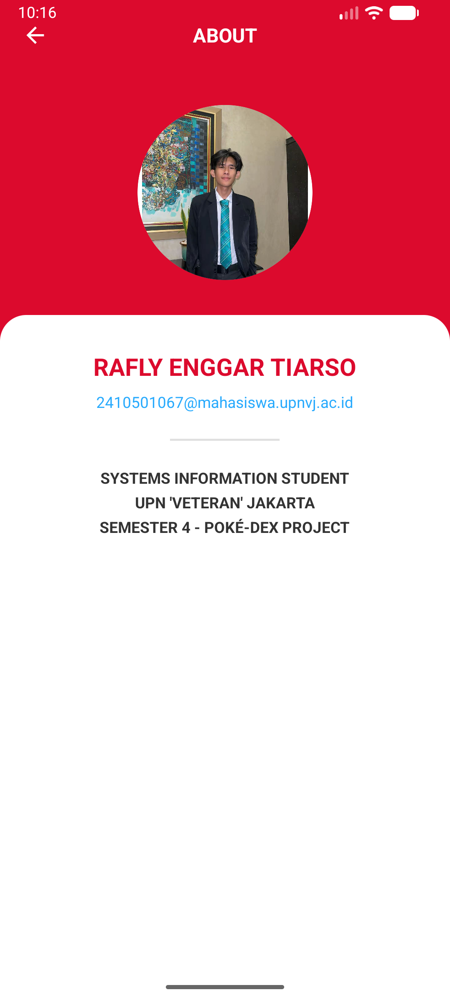

# UAS - POKÉ-ENDEMIK INDONESIA

Aplikasi Android berbasis Java yang menyajikan informasi mengenai hewan dan tumbuhan endemik di Indonesia dengan estetika visual yang terinspirasi oleh **Pokédex** dari seri Pokémon. Proyek ini dikembangkan sebagai tugas akhir (UAS) Semester 4.

## Fitur Utama
- **Estetika Pokédex:** Antarmuka pengguna (UI) bertema merah ikonik dengan elemen visual khas Pokédex.
- **Sinkronisasi Data (Online/Offline):** Mengambil data dari API dan menyimpannya ke database lokal menggunakan Room Database.
- **Daftar Hewan & Tumbuhan:** Menampilkan daftar flora dan fauna endemik dengan kategori terpisah dalam bentuk grid card.
- **Pencarian:** Memudahkan pengguna menemukan spesies tertentu berdasarkan nama.
- **Favorit:** Menyimpan data ke daftar favorit untuk akses cepat dan offline.
- **Detail Informasi:** Menampilkan deskripsi lengkap, foto, dan kategori spesies dengan tata letak ala ensiklopedia digital.
- **Dark Mode Support:** Mendukung tema gelap dan terang (Toggleable) yang terintegrasi dengan palet warna Pokédex.
- **Halaman About:** Informasi mengenai pengembang aplikasi.

## Tech Stack
- **Language:** Java
- **UI Framework:** Material Design 3 (DayNight Theme)
- **Database:** Room Persistence Library
- **Networking:** Retrofit & Gson (untuk integrasi API)
- **Image Loading:** Glide
- **Architecture:** Local-Remote Data Synchronization

## Informasi Pengembang
- **Nama:** Rafly Enggar Tiarso
- **NIM:** 2410501067
- **Kelas:** B
- **Institusi:** UPN "Veteran" Jakarta
- **Program Studi:** Sistem Informasi
- **Tujuan Proyek:** Ujian Akhir Semester (UAS) Pemrograman Mobile

## Konsep Desain
Aplikasi ini mengadopsi palet warna Pokédex:
- **Primary Red (#DC0A2D):** Digunakan untuk header dan elemen identitas utama.
- **Info Blue (#28AAFD):** Digunakan untuk tombol aksi dan elemen interaktif.
- **Clean White & Light Gray:** Memberikan kesan modern dan bersih pada area konten.
- **Typography:** Menggunakan kapitalisasi (All-Caps) pada judul untuk memperkuat kesan perangkat digital.

## Layar

  
  
  

  
  
  

  
  

---
© 2024 Rafly Enggar Tiarso - UAS Project.
